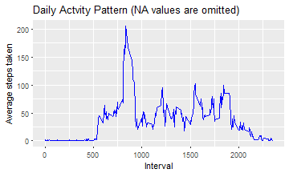

## Reproducible Research: Peer Assessment 1
This assignment analyses personal activity monitoring data by each and interval. The data is obtained from datast "[Activity Monitoring data.csv](https://d396qusza40orc.cloudfront.net/repdata%2Fdata%2Factivity.zip)" that contain number of steps taken for every five minute interval for each day. 


The aim of the analysis is determine  
* What is mean and total number of steps taken per day  
* Determine the average daily Pattern  
* Compare the activity patterns between weekday and weekends   


## Loading and preprocessing the data

In this step, we load the csv file provided is loaded using read.csv().  In this case it is "[Activity Monitoring data.csv](https://d396qusza40orc.cloudfront.net/repdata%2Fdata%2Factivity.zip)"

Once loaded, the data is preprocessed to remove the NA values from the dataset


```r
# install dplyr package if not already installed
  if("dplyr" %in% rownames(installed.packages()) == FALSE) {install.packages("dplyr")}
  if("ggplot2" %in% rownames(installed.packages()) == FALSE) {install.packages("ggplot2")}

## load dplyr & ggplot2 package
  suppressPackageStartupMessages(library(data.table))
  suppressPackageStartupMessages(library(dplyr))
  suppressPackageStartupMessages(library(plyr))
  suppressPackageStartupMessages(library(ggplot2))


  act_raw <- data.table(read.csv("data/activity.csv", stringsAsFactors = FALSE,
                       colClasses = c("numeric","POSIXct","integer")))

# convert it to tibble for easy application dplyr functions
  act_raw <- tbl_df(act_raw) 

# pre-process the raw dataset to remove NA & create two dataset one for date and another for interval
  activity_bydt <- act_raw %>% select(steps,date) %>% na.omit() %>% group_by(date)
  activity_byint <- act_raw %>% select(steps,interval) %>% na.omit() %>% group_by(interval)
```

A small verification is done by displaying summary of the data set loaded

```r
    summary(act_raw)
```

```
##      steps             date                        interval     
##  Min.   :  0.00   Min.   :2012-10-01 00:00:00   Min.   :   0.0  
##  1st Qu.:  0.00   1st Qu.:2012-10-16 00:00:00   1st Qu.: 588.8  
##  Median :  0.00   Median :2012-10-31 00:00:00   Median :1177.5  
##  Mean   : 37.38   Mean   :2012-10-31 00:25:34   Mean   :1177.5  
##  3rd Qu.: 12.00   3rd Qu.:2012-11-15 00:00:00   3rd Qu.:1766.2  
##  Max.   :806.00   Max.   :2012-11-30 00:00:00   Max.   :2355.0  
##  NA's   :2304
```
## What is mean and total number of steps taken per day?
This is the first exploratory step to understand activity pattern on daily basis. For this we omt the missing values.  

Here we calculate and report  
* Total number of steps taken each day.  
* A histogram of total number of steps each day.    
* Mean and Median of the daily acitity.  


```r
      # 1. Calculate total steps in a day and NA values are omitted
      # store the summary values in summary dataset

      daywise_rpt_bf <- activity_bydt %>% summarise_each(funs(total_stps = sum))
      
      # plot histogram for total_steps_byday
      
      ggplot(daywise_rpt_bf, aes(daywise_rpt_bf$total_stps)) + geom_histogram() +
          xlab("Total Steps taken each day") + ylab("Count") +
              ggtitle("Total steps taken each day before NA values are imputed") 
```


We also calculate the mean and median for steps taken for each day

```r
      # Calculate mean and median for each day and store in summary dataset
      daywise_rpt_bf <- join(daywise_rpt_bf, 
                             activity_bydt %>% summarise_each(funs(mean_stps = mean)), 
                                by = c("date"))
      daywise_rpt_bf <- join(daywise_rpt_bf, 
                             activity_bydt %>% summarise_each(funs(median_stps = median)), 
                                by = c("date"))
```

The mean and median values for each day is as below  

```r
    daywise_rpt_bf 
```

```
##          date total_stps  mean_stps median_stps
## 1  2012-10-02        126  0.4375000           0
## 2  2012-10-03      11352 39.4166667           0
## 3  2012-10-04      12116 42.0694444           0
## 4  2012-10-05      13294 46.1597222           0
## 5  2012-10-06      15420 53.5416667           0
## 6  2012-10-07      11015 38.2465278           0
## 7  2012-10-09      12811 44.4826389           0
## 8  2012-10-10       9900 34.3750000           0
## 9  2012-10-11      10304 35.7777778           0
## 10 2012-10-12      17382 60.3541667           0
## 11 2012-10-13      12426 43.1458333           0
## 12 2012-10-14      15098 52.4236111           0
## 13 2012-10-15      10139 35.2048611           0
## 14 2012-10-16      15084 52.3750000           0
## 15 2012-10-17      13452 46.7083333           0
## 16 2012-10-18      10056 34.9166667           0
## 17 2012-10-19      11829 41.0729167           0
## 18 2012-10-20      10395 36.0937500           0
## 19 2012-10-21       8821 30.6284722           0
## 20 2012-10-22      13460 46.7361111           0
## 21 2012-10-23       8918 30.9652778           0
## 22 2012-10-24       8355 29.0104167           0
## 23 2012-10-25       2492  8.6527778           0
## 24 2012-10-26       6778 23.5347222           0
## 25 2012-10-27      10119 35.1354167           0
## 26 2012-10-28      11458 39.7847222           0
## 27 2012-10-29       5018 17.4236111           0
## 28 2012-10-30       9819 34.0937500           0
## 29 2012-10-31      15414 53.5208333           0
## 30 2012-11-02      10600 36.8055556           0
## 31 2012-11-03      10571 36.7048611           0
## 32 2012-11-05      10439 36.2465278           0
## 33 2012-11-06       8334 28.9375000           0
## 34 2012-11-07      12883 44.7326389           0
## 35 2012-11-08       3219 11.1770833           0
## 36 2012-11-11      12608 43.7777778           0
## 37 2012-11-12      10765 37.3784722           0
## 38 2012-11-13       7336 25.4722222           0
## 39 2012-11-15         41  0.1423611           0
## 40 2012-11-16       5441 18.8923611           0
## 41 2012-11-17      14339 49.7881944           0
## 42 2012-11-18      15110 52.4652778           0
## 43 2012-11-19       8841 30.6979167           0
## 44 2012-11-20       4472 15.5277778           0
## 45 2012-11-21      12787 44.3993056           0
## 46 2012-11-22      20427 70.9270833           0
## 47 2012-11-23      21194 73.5902778           0
## 48 2012-11-24      14478 50.2708333           0
## 49 2012-11-25      11834 41.0902778           0
## 50 2012-11-26      11162 38.7569444           0
## 51 2012-11-27      13646 47.3819444           0
## 52 2012-11-28      10183 35.3576389           0
## 53 2012-11-29       7047 24.4687500           0
```
## What is the average daily activity pattern?
To understand the daily activity pattern, we calculate the average of number of steps taken across all days for each of the 5-minute interval values


```r
    # WE use the activity_byint dataset created during preprocessing step to calculate meadn
    avgsteps_byint <- activity_byint %>% summarise_each(funs(mean))
```

Once the average steps are calculated across all days by interval, we see the relationship with a time series plot between interval and aaverage steps taken


```r
  # time series plot for average steps taken  by interval
    ggplot(avgsteps_byint, aes(x = interval, y = steps)) + geom_line(col = "blue")+
          xlab("Interval") + ylab( "Average steps taken") +
            ggtitle("Daily Actvity Pattern (NA values are omitted) ")
```



```r
  # find the 5-minute interval, on average across all the days in the dataset, contains the maximum number of steps
  int_maxavg <- head(avgsteps_byint %>% arrange(desc(steps)),1)$interval
```

The above line plot shows the variation average steps taken across intervals. We can see that the **interval 835** contains the maximum number of steps


## Imputing missing values
However one of the issues is that the raw datafile contains a number of missing values which have an impact on the analysis


```r
    totalNAs <- sum(is.na(act_raw$steps)) # calculate total NA values in dataset
```
With the above code, we see that we have **2304** in the raw dataset provided.

Now, it is required that we identify a way to fill / impute the missing values some relevant data so we can understand the activity pattern better

**Adopted data imputing strategy**: Here I have used mean for that 5-minute time interval as the data to be used when a NA is found

For instance, consider NA value for date 2012-10-01 and Interval 5. We have already calculate the mean for interval 5 as part of the daily activity pattern by interval step. We can use the mean for interval 5 for the above instance


```r
      # the mean for that 5-min interval is used to populate the missing NA values

      # convert avg steps per interval to a dataframe to enable usage of rownames
      mn_int <- as.data.frame(avgsteps_byint)
      row.names(mn_int) <- avgsteps_byint$interval
      
      # Find the relevant 5-min interval mean and populate in the NA value
      act_NAfilled <- act_raw %>% 
                          mutate_at(c("steps"),
                            funs(ifelse(is.na(.),
                              round(mn_int[c(paste("",interval,"", sep = "")),2],0),
                                .)))
```
A new dataset **act_NAfilled** is created from the raw data with same number of rows **17568**.  
The below comparison shows the filled in value 

Before Imputing...  

```r
      head(act_raw, 3)
```

```
## # A tibble: 3 × 3
##   steps       date interval
##   <dbl>     <dttm>    <int>
## 1    NA 2012-10-01        0
## 2    NA 2012-10-01        5
## 3    NA 2012-10-01       10
```

After Imputing ...  

```r
    head(act_NAfilled,3)
```

```
## # A tibble: 3 × 3
##   steps       date interval
##   <dbl>     <dttm>    <int>
## 1     2 2012-10-01        0
## 2     0 2012-10-01        5
## 3     0 2012-10-01       10
```

Let's calculate the total number of steps, mean and median as before again with new dataset


```r
    # create subset of the dataset containing only steps and date
    act_NAfilled_subst <- act_NAfilled %>% select(steps, date) %>%
                          group_by(date)

    # Calculate the total number of steps by date
    daywise_rpt_aft <- act_NAfilled_subst %>% summarise_each(funs(total_stps = sum))

    # Plot an histogram for the aboe
    ggplot(daywise_rpt_aft, aes(daywise_rpt_aft$total_stps)) + geom_histogram() +
        xlab("Total Steps taken each day") + ylab("Count") +
            ggtitle("Total steps taken each day after NA values are imputed") 
```


The above histogram shows different count pattern to that of the earlier histogram.

We also calculate and report the mean and median values


```r
    # Calculate the mean and median for new dataset  
    daywise_rpt_aft <- join(daywise_rpt_aft, 
                          act_NAfilled_subst %>% summarise_each(funs(mean_stps = mean)), 
                              by = c("date"))
    daywise_rpt_aft <- join(daywise_rpt_aft, 
                          act_NAfilled_subst %>% summarise_each(funs(median_stps = median)), 
                              by = c("date"))
```

The mean and median values for each day for new updated dataset is as below


```r
     daywise_rpt_aft 
```

```
##          date total_stps  mean_stps median_stps
## 1  2012-10-01      10762 37.3680556        34.5
## 2  2012-10-02        126  0.4375000         0.0
## 3  2012-10-03      11352 39.4166667         0.0
## 4  2012-10-04      12116 42.0694444         0.0
## 5  2012-10-05      13294 46.1597222         0.0
## 6  2012-10-06      15420 53.5416667         0.0
## 7  2012-10-07      11015 38.2465278         0.0
## 8  2012-10-08      10762 37.3680556        34.5
## 9  2012-10-09      12811 44.4826389         0.0
## 10 2012-10-10       9900 34.3750000         0.0
## 11 2012-10-11      10304 35.7777778         0.0
## 12 2012-10-12      17382 60.3541667         0.0
## 13 2012-10-13      12426 43.1458333         0.0
## 14 2012-10-14      15098 52.4236111         0.0
## 15 2012-10-15      10139 35.2048611         0.0
## 16 2012-10-16      15084 52.3750000         0.0
## 17 2012-10-17      13452 46.7083333         0.0
## 18 2012-10-18      10056 34.9166667         0.0
## 19 2012-10-19      11829 41.0729167         0.0
## 20 2012-10-20      10395 36.0937500         0.0
## 21 2012-10-21       8821 30.6284722         0.0
## 22 2012-10-22      13460 46.7361111         0.0
## 23 2012-10-23       8918 30.9652778         0.0
## 24 2012-10-24       8355 29.0104167         0.0
## 25 2012-10-25       2492  8.6527778         0.0
## 26 2012-10-26       6778 23.5347222         0.0
## 27 2012-10-27      10119 35.1354167         0.0
## 28 2012-10-28      11458 39.7847222         0.0
## 29 2012-10-29       5018 17.4236111         0.0
## 30 2012-10-30       9819 34.0937500         0.0
## 31 2012-10-31      15414 53.5208333         0.0
## 32 2012-11-01      10762 37.3680556        34.5
## 33 2012-11-02      10600 36.8055556         0.0
## 34 2012-11-03      10571 36.7048611         0.0
## 35 2012-11-04      10762 37.3680556        34.5
## 36 2012-11-05      10439 36.2465278         0.0
## 37 2012-11-06       8334 28.9375000         0.0
## 38 2012-11-07      12883 44.7326389         0.0
## 39 2012-11-08       3219 11.1770833         0.0
## 40 2012-11-09      10762 37.3680556        34.5
## 41 2012-11-10      10762 37.3680556        34.5
## 42 2012-11-11      12608 43.7777778         0.0
## 43 2012-11-12      10765 37.3784722         0.0
## 44 2012-11-13       7336 25.4722222         0.0
## 45 2012-11-14      10762 37.3680556        34.5
## 46 2012-11-15         41  0.1423611         0.0
## 47 2012-11-16       5441 18.8923611         0.0
## 48 2012-11-17      14339 49.7881944         0.0
## 49 2012-11-18      15110 52.4652778         0.0
## 50 2012-11-19       8841 30.6979167         0.0
## 51 2012-11-20       4472 15.5277778         0.0
## 52 2012-11-21      12787 44.3993056         0.0
## 53 2012-11-22      20427 70.9270833         0.0
## 54 2012-11-23      21194 73.5902778         0.0
## 55 2012-11-24      14478 50.2708333         0.0
## 56 2012-11-25      11834 41.0902778         0.0
## 57 2012-11-26      11162 38.7569444         0.0
## 58 2012-11-27      13646 47.3819444         0.0
## 59 2012-11-28      10183 35.3576389         0.0
## 60 2012-11-29       7047 24.4687500         0.0
## 61 2012-11-30      10762 37.3680556        34.5
```

We can easily observe that 8 days of missing data has been added onto to the new dataset. Also the count is recorded higher in the histogram after imputing data.  

The  median value for steps were zero before imputing, now median values exist for few date patterns

## Are there differences in activity patterns between weekdays and weekends?
Now that we have added the missing values, we can do further analysis by categorising the daily activty into weekday and week end

To do that, we a add new column to he imputed dataset called "whichday". This column will contain whether the given date is a weekday or weekend


```r
    # using weekdays() and date column, determine if it is weekday or weekend
    # use mutate function to add the col to the dataset
    act_NAfilled <- act_NAfilled %>% 
                    mutate_at(c("date"), 
                        funs(whichday = ifelse(weekdays(.) %in% 
                            c("Saturday", "Sunday"), "weekend", "weekday")) )
```

Now if we look at the top 3 rows, we will see


```r
    head(act_NAfilled, 3)
```

```
## # A tibble: 3 × 4
##   steps       date interval whichday
##   <dbl>     <dttm>    <int>    <chr>
## 1     2 2012-10-01        0  weekday
## 2     0 2012-10-01        5  weekday
## 3     0 2012-10-01       10  weekday
```

We can now compare the daily activity pattern across weekday and weekend and plot it as timeseries plot


```r
      # calculate the mean by interval and whichday
      avgsteps_byday_int <- act_NAfilled %>% select(steps,interval, whichday) %>%
          group_by(interval, whichday) %>% summarise_each(funs(mean))

    # generate a time series plot for both weekday and weekend for comparison
    ggplot(avgsteps_byday_int, aes(x = interval, y = steps)) + geom_line(col = "blue") +
        facet_grid(whichday ~.) + xlab("Interval") + ylab("Average steps taken") +
            ggtitle("Daily pattern across weekday and weekend")
```


The above panel plot shows weekend experience more activity across various interval whereas in a weekday only a few intervals are busy

This completes first level of analysis of the activity monitoring data
